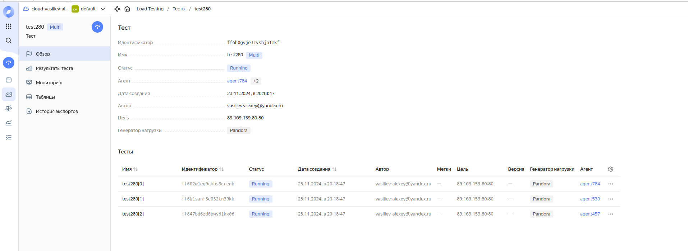
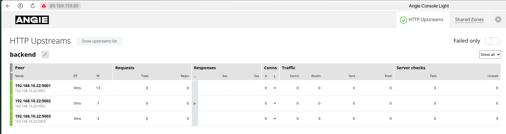
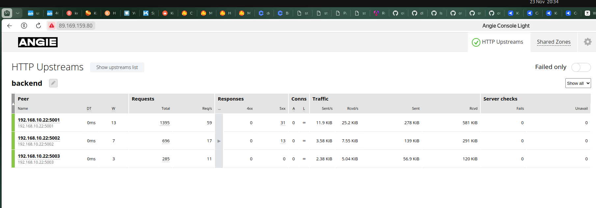
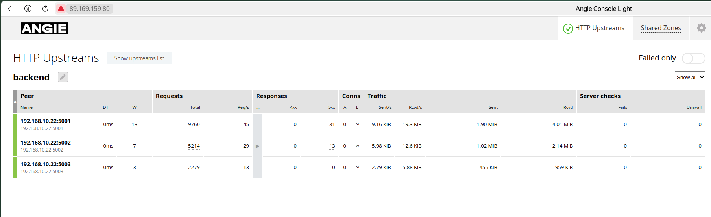
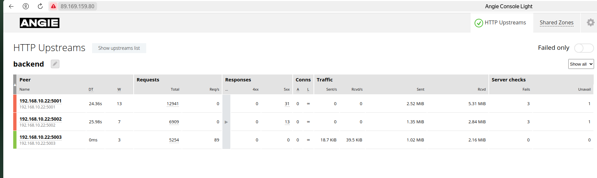

# Балансировка HTTP

## Цель:

Настроить схему балансировки на уровне HTTP.

## Описание/Пошаговая инструкция выполнения домашнего задания:

### Инструкция:

1. Создайте несколько копий бэкендов.
2. Настройте балансировку по следующим вариантам:
   * Равномерная балансировка (round robin).
   * Балансировка по хэшу с использованием переменных (на выбор).
   * Произвольная балансировка (random).
3. Покажите варианты конфигурации с резервным бэкендом и с отключением одного из бэкендов.
4. Протестируйте корректность настроенных схем.

### Критерии оценки:

Статус "Принято", если для всех вариантов конфигурации проведён тест работоспособности.

---  

## Решение

1. Регистрируемся в облачном сервисе Yandex Cloud

2. Создаем Folder в облачном сервисе

2. Создаем сервисный аккаунт

```sh
yc iam service-account create --name otus-hl-sa


yc iam service-account list

yc iam service-account list                                                                                                                                                                                                                                                                                       
+----------------------+------------+--------+
|          ID          |    NAME    | LABELS |
+----------------------+------------+--------+
| aje...ed5 | otus-hl-sa |        |
+----------------------+------------+--------+

yc iam key create   --service-account-id aje...ed5  --folder-id b1....et2   --output key.json

yc config set service-account-key key.json


```

3. Назначаем роли для сервисного аккаунта на папку - default

```sh
yc resource-manager folder add-access-binding default   --role admin   --subject serviceAccount:aje...ed5
```

4. Выставляем переменные для terraform скрипта в переменные среды

```sh
export YC_TOKEN=$(yc iam create-token)
export YC_CLOUD_ID=$(yc config get cloud-id)
export YC_FOLDER_ID=$(yc config get folder-id)                                                
```

5. Запускаем terraform

``` sh
terraform  apply -var-file="yc.tfvars"                 
```

В консоли выполнения должно быть надпись с внешним IP созданной виртуалки c балансировщиком

```sh

Outputs:

Адрес-ip-LB = "89.169.159.80"

```

6. Проверяем работу (видим что успешно работает) - фронт загружается. Бекнд работает.

[http://89.169.159.80/](hhttp://89.169.159.80/)

7. Создаем тестового агента в сервисе нагрузочного тетсирования


[Как начать работать с Yandex Load Testing](https://yandex.cloud/ru/docs/load-testing/quickstart?from=int-console-help-center-or-nav)

Конфигурация теста

```yaml
pandora:
  enabled: true
  package: yandextank.plugins.Pandora
  config_content:
    pools:
      - id: HTTP
        gun:
          type: http
          target: 89.169.159.80:80
          ssl: false
        ammo:
          type: uri
          uris:
            - /api/articles?limit=10&offset=0
        result:
          type: phout
          destination: ./phout.log
        startup:
          type: once
          times: 1000
        rps:
          - type: const
            ops: 30
            duration: 300s
        discard_overflow: true
    log:
      level: error
    monitoring:
      expvar:
        enabled: true
        port: 1234
autostop:
  enabled: true
  package: yandextank.plugins.Autostop
  autostop:
    - limit(5m)
core: { }

```

## Тестируем различные виды балансировки

### Round-robin

1.В конфигурации установлееы следующие upstreams:

```php
   upstream backend {
   # defaults round-robin
    zone backend 10m;
    server 192.168.10.22:5001; #weight=5;
    server 192.168.10.22:5002;
    server 192.168.10.22:5003   backup;

}
```

2. Запускаем тест на 30 rps и длиной в 300 секунд

Начало


Запуск теста


Видимо что нагружается 2 бекенда равномерно, 3 в резерве


Останавливаем бекенд 1 и 2

```sh
ubuntu@be:~$ sudo systemctl stop backend_5001
ubuntu@be:~$ sudo systemctl stop backend_5002
```

Нагружается только бекенд 3


Запускаем бекенд 1 и 2

```sh
ubuntu@be:~$ sudo systemctl start backend_5001
ubuntu@be:~$ sudo systemctl start backend_5002
```


Видим, что в момент переключения идут отказы тестах


### Hash

 Созадим еще агентов для тестирования по hash


В конфигурации установлееы следующие upstreams:

```php
upstream backend {
   
    hash $remote_addr;	    
    zone backend 10m;

    server 192.168.10.22:5001;
    server 192.168.10.22:5002;
    server 192.168.10.22:5003;
}
```

 Запускаем тест c 3 агентов
   
 Видим, что нагружается 2 бекенда хши распределяются не равномерно, 0-2-1
   

Останавливаем бекенд 1 и 2

```SH
ubuntu@be:~$ sudo systemctl start backend_5001
ubuntu@be:~$ sudo systemctl start backend_5002
```

Нагружается только бекенд 3 и он взял нагрузку на себя (~90 RPS как заложено генератором нагрузки)
   

## Random

```PHP
upstream backend {
  
    random;	    
    zone backend 10m;
    server 192.168.10.22:5001 weight=13;
    server 192.168.10.22:5002 weight=7;
    server 192.168.10.22:5003 weight=3;;
}

```

Видимо распределение бекендов согласно весам

Запускем тест - но видимо что 1 и 2 бекенд немного не справляются с нагрузкой и пятисоят


Но в итоге с гагрузкой справдляются    


Останавливаем бекенд 1 и 2

```SH
ubuntu@be:~$ sudo systemctl start backend_5001
ubuntu@be:~$ sudo systemctl start backend_5002
```

Нагружается только бекенд 3 и он взял нагрузку на себя (~90 RPS как заложено генератором нагрузки)





---

